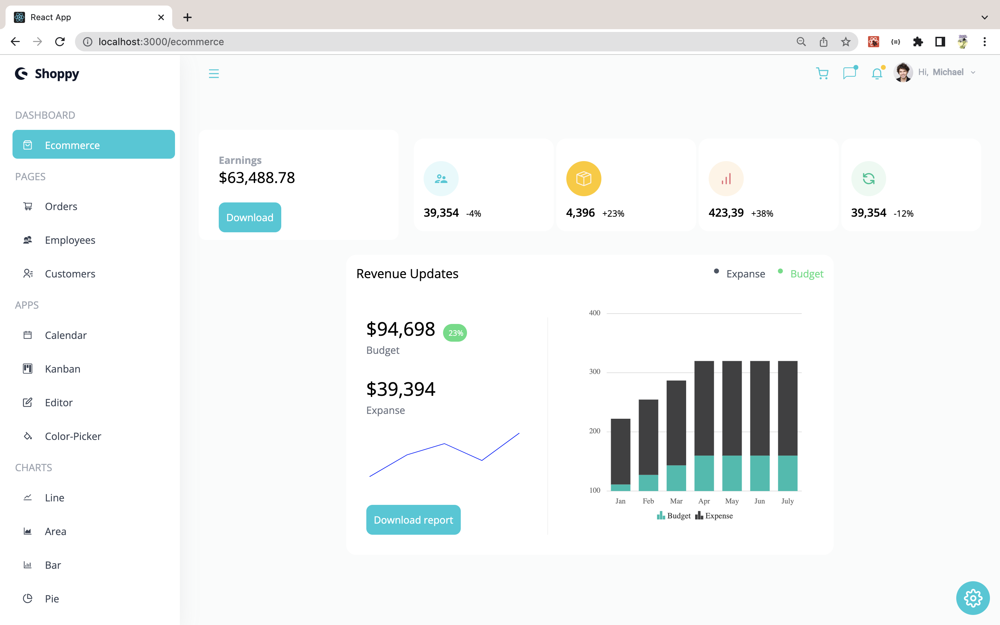
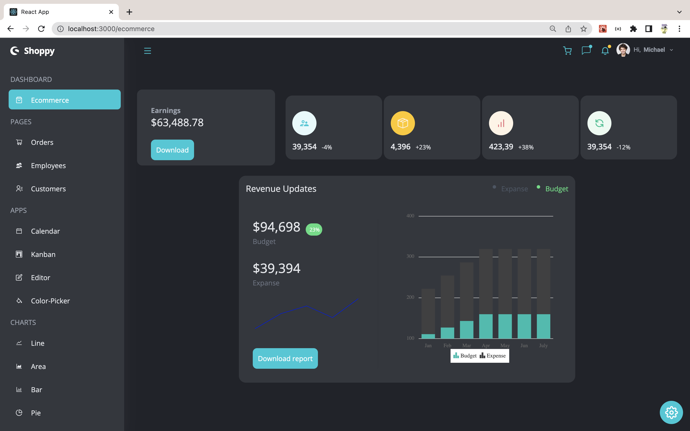

# Modern Dashboard

## info:
<code>Build and Deployed a React Admin Dashboard App With Theming, Tables, Charts, Calendar, Kanban and More using Syncfusion and TailwindCSS</code>

## Light Mode

## Dark Mode

## built with:
<code>ReactJS</code>
<code>TailwindCSS</code>
<code>Syncfusion</code>
<code>npm</code>

## Data:
<code>For training purposes, all data comes from a dummy data file</code>

## Repository-link:
[professional_dashboard](https://github.com/Borkkris/professional_Dashboard)

## Deployed on <code>Netlify</code>:
[Modern-Dashboard-Syncfusion](https://modern-dashboard-syncfusion.netlify.app)
